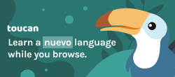
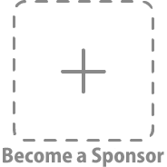

# <sub></sub> Tab-Session-Manager

#### Save and restore the state of browser windows and tabs. It also supports automatic saving.


## Download

[](https://addons.mozilla.org/firefox/addon/tab-session-manager/)

[](https://chrome.google.com/webstore/detail/tab-session-manager/iaiomicjabeggjcfkbimgmglanimpnae/)

[for Microsoft Edge](https://microsoftedge.microsoft.com/addons/detail/jkjjclfiflhpjangefhgfjhgfbhajadk/)

## Backers

Thank you to the awesome **[backers](https://github.com/sienori/Tab-Session-Manager/blob/master/BACKERS.md)** who support Tab Session Manager!

[](https://www.patreon.com/sienori)
[](https://www.paypal.me/sienoriExt)

## Sponsors

Support Tab Session Manager by [becoming a sponsor](https://www.patreon.com/join/sienori). Thank you to our wonderful sponsors!

[](https://jointoucan.com/partners/tab-session-manager)

[](https://www.patreon.com/join/sienori)

## Tools

**[Session Compressor](https://tab-session-manager.sienori.com/compressor/index.html)**  
A tool for compressing sessions created by Tab Session Manager

## Translation

You can contribute by translating Tab Session Manager on **[Crowdin](https://crowdin.com/project/tab-session-manager)**.

## Developing

> Required: Node 18.19.1, npm 10.2.4

1. Clone the repository `git clone https://github.com/sienori/Tab-Session-Manager`
2. Create the file `src/credentials.js`

```src/credentials.js
export const clientId = "xxx"
export const clientSecret = "xxx"
```

3. Run `npm install`
4. Run `npm run watch-dev`

### Load the extension in Chrome

1. Open Chrome browser and navigate to `chrome://extensions`
2. Select "Developer Mode" and then click "Load unpacked extension..."
3. From the file browser, choose to `tab-session-manager/dev/chrome`

### Load the extension in Firefox

1. Open Firefox browser and navigate to `about:debugging`
2. Click "Load Temporary Add-on" and from the file browser, choose `tab-session-manager/dev/firefox`

## Privacy Policy

[Privacy Policy](https://tab-session-manager.sienori.com/privacy-policy) of Tab Session Manager
